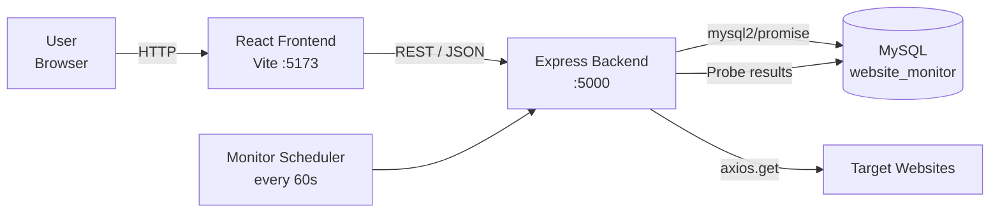
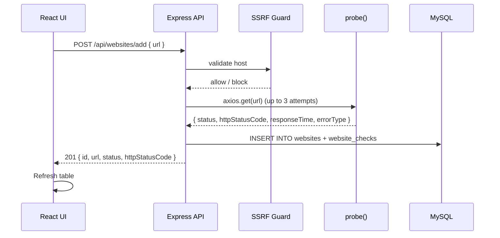
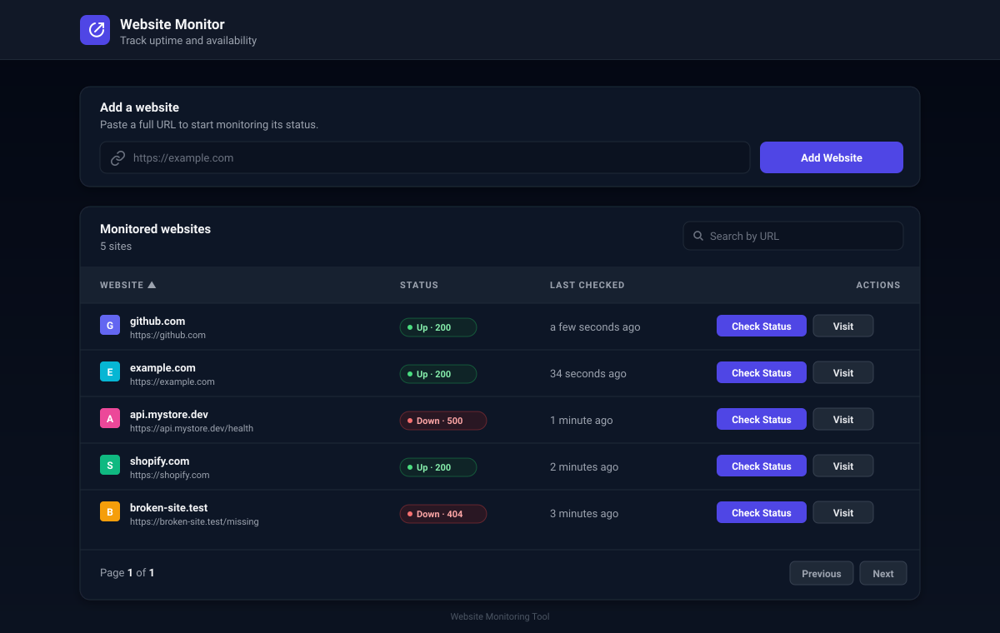
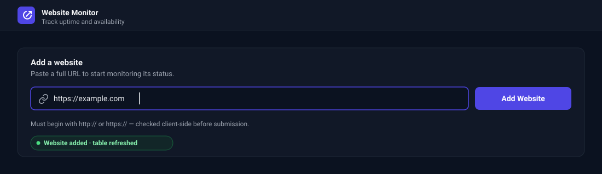
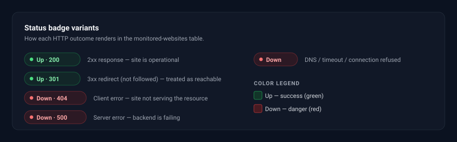

# Website Monitoring Tool

A full-stack uptime monitoring dashboard. Add any website URL and the tool continuously probes it, records every response, and shows you at a glance whether each site is **Up** or **Down** — along with its HTTP status code, response time, and uptime percentage.

> **Tech stack:** React (Vite) · Node.js + Express · MySQL (`mysql2/promise`) · Tailwind CSS · Axios

---

## Table of Contents

- [Overview](#overview)
- [Features](#features)
- [Architecture](#architecture)
- [How Status Is Determined](#how-status-is-determined)
- [Screenshots](#screenshots)
- [Getting Started](#getting-started)
- [Configuration](#configuration)
- [Using the App](#using-the-app)
- [API Reference](#api-reference)
- [Database Schema](#database-schema)
- [Project Structure](#project-structure)
- [Use Cases](#use-cases)
- [Roadmap](#roadmap)
- [Contributing](#contributing)
- [License](#license)

---

## Overview

The **Website Monitoring Tool** helps developers, ops teams, and site owners keep an eye on the availability of the URLs they care about. Instead of repeatedly refreshing browser tabs or waiting for customers to report outages, you get:

- A live list of every site you've added,
- Automatic background checks every 60 seconds,
- Response times and historical uptime percentages,
- On-demand re-checks and direct links to visit each site.

The backend performs an outbound HTTP `GET` against each target URL, interprets the response, and stores the result. The frontend renders this as a clean, searchable, sortable table.

---

## Features

| Category | Feature |
|---|---|
| **Monitoring** | Background scheduler probes every registered website every 60 seconds |
| **Smart probing** | 5-second request timeout, up to 5 redirects followed, 3 automatic retries on failure |
| **Accurate status** | Correctly classifies `2xx` / `3xx` as **Up** and `4xx` / `5xx` / network failures as **Down** |
| **Response time** | Every check records how long the target took to respond |
| **History** | Every probe is persisted to `website_checks` — queryable per site |
| **Uptime stats** | Rolling uptime percentage over `1h` / `24h` / `7d` / `30d` windows |
| **Error typing** | DNS failure, timeout, connection refused, connection reset, too many redirects, `http_4xx`, `http_5xx` |
| **UI** | React + Tailwind dashboard with search, sort, pagination, and per-row re-check / visit buttons |
| **Security** | SSRF guard blocks private / loopback / link-local IP ranges before probing |
| **CORS** | Configurable allow-list of origins for production deployment |
| **Clean logs** | Morgan request logging + structured monitor tick logs |

---

## Architecture



- **Frontend** calls the backend's REST API to list, add, and re-check sites.
- **Backend** performs outbound HTTP probes and writes results into MySQL.
- **Monitor** is an in-process scheduler that re-probes every site each minute.
- **SSRF guard** rejects URLs that resolve to private/loopback ranges before any probe is sent.

### Probe flow



---

## How Status Is Determined

A website is classified **Up** only when the server returns a success or redirect status code. Any client error, server error, or network failure is reported as **Down**.

| HTTP response / outcome | `status` | Shown on frontend |
|---|---|---|
| `200`–`299` (OK, No Content, …) | `Up` | Green badge — `Up · 200` |
| `300`–`399` (redirect not followed) | `Up` | Green badge — `Up · 301` |
| `400`–`499` (Bad Request, Unauthorized, Not Found, …) | `Down` | Red badge — `Down · 404` |
| `500`–`599` (Server Error, Bad Gateway, …) | `Down` | Red badge — `Down · 500` |
| DNS failure (`ENOTFOUND`, `EAI_AGAIN`) | `Down` | Red badge — error type `dns_failure` |
| Timeout (`ETIMEDOUT`, `ECONNABORTED`) | `Down` | Red badge — error type `timeout` |
| Connection refused / reset | `Down` | Red badge — error type `connection_refused` / `connection_reset` |
| Too many redirects | `Down` | Red badge — error type `too_many_redirects` |

Each probe is retried up to **3 times** (1s apart) before the result is committed, to avoid flagging transient blips as outages.

---

## Screenshots

A quick visual tour of the dashboard — the dark-themed UI built with React + Tailwind.

### Main dashboard

The monitored-websites table with search, sort, per-row status badges, and actions. Each row shows the site favicon, URL, current status with HTTP code, when it was last checked, and buttons to re-check or visit the site.



### Add a website

Paste any `http://` or `https://` URL — it's validated client-side, probed immediately, and added to the table without a page reload.



### Status badges

Every HTTP outcome maps to a clear visual state. Green (Up) for 2xx/3xx, red (Down) for 4xx/5xx and network failures.



> Screenshots live in `docs/screenshots/` as SVGs so they commit cleanly and render crisply on any display. Replace them with real PNG captures of your own deployment any time — just keep the filenames.

---

## Getting Started

### Prerequisites

- **Node.js 18+**
- **MySQL 8** (or MariaDB 10.5+)
- `npm` (ships with Node)

### 1. Clone the repo

```bash
git clone https://github.com/<your-username>/Website_Monitoring_Tool.git
cd Website_Monitoring_Tool
```

### 2. Set up the database

```bash
mysql -u root -p -e "CREATE DATABASE website_monitor;"
mysql -u root -p website_monitor < Database/website_monitor.sql
```

Tables `websites` and `website_checks` are created/upgraded automatically by the backend at startup if missing.

### 3. Configure environment variables

```bash
cp backend/.env.example backend/.env
cp frontend/.env.example frontend/.env
```

Edit `backend/.env` with your MySQL credentials and allowed CORS origin (see [Configuration](#configuration)).

### 4. Install dependencies and run

**Backend** (terminal 1):

```bash
cd backend
npm install
node index.js
# → Server running on port 5000
# → [monitor] started (every 60s)
```

**Frontend** (terminal 2):

```bash
cd frontend
npm install
npm run dev
# → http://localhost:5173
```

Open **http://localhost:5173** and start adding websites.

---

## Configuration

### Backend — `backend/.env`

| Variable | Default | Purpose |
|---|---|---|
| `NODE_ENV` | — | `production` in prod enables strict CORS + generic error messages |
| `PORT` | `5000` | Express listen port |
| `CORS_ORIGIN` | — | Comma-separated list of allowed frontend origins |
| `DB_HOST` | `localhost` | MySQL host |
| `DB_PORT` | `3306` | MySQL port |
| `DB_USER` | — | MySQL user |
| `DB_PASSWORD` | — | MySQL password |
| `DB_NAME` | `website_monitor` | Database name |
| `DB_POOL_LIMIT` | `10` | Max pool connections |

In development, CORS automatically permits `localhost` / `127.0.0.1` origins on any port, so no extra config is needed locally.

### Frontend — `frontend/.env`

| Variable | Default | Purpose |
|---|---|---|
| `VITE_API_BASE_URL` | `http://localhost:5000` | Backend base URL used by the Axios client |

Anything placed in the frontend `.env` is shipped to the browser — **do not put secrets there.**

---

## Using the App

1. **Add a website.** Type a full URL (including `http://` or `https://`) into the input at the top of the page and click **Add Website**. The URL is immediately probed and inserted into the table.
2. **Watch the status.** The table shows the status badge, last-checked timestamp, and status code for each site. The background monitor re-probes every site once a minute.
3. **Force a re-check.** Click **Check Status** on any row to probe that site immediately.
4. **Search & sort.** Use the search box to filter by URL. Click column headers to sort by URL, status, or last-checked time.
5. **Visit.** Click **Visit** to open the site in a new tab.

---

## API Reference

Base URL: `http://localhost:5000`

### `GET /health`

Health probe.

```json
{ "ok": true }
```

---

### `POST /api/websites/add`

Add a new site. Triggers an immediate probe; the row is inserted with the result.

**Request**

```json
{ "url": "https://example.com" }
```

**Response `201`**

```json
{
  "id": 12,
  "url": "https://example.com",
  "status": "Up",
  "httpStatusCode": 200,
  "responseTime": 187
}
```

**Errors**

- `400` — malformed URL, non-`http(s)` scheme, or blocked by SSRF guard (private/loopback IP).

---

### `GET /api/websites/`

Return every monitored website.

**Response `200`**

```json
[
  {
    "id": 1,
    "url": "https://example.com",
    "status": "Up",
    "httpStatusCode": 200,
    "responseTime": 187,
    "lastChecked": "2026-04-22T12:30:00.000Z"
  }
]
```

---

### `POST /api/websites/check-status`

Re-probe a single website and update its row.

**Request**

```json
{ "id": 1, "url": "https://example.com" }
```

**Response `200`**

```json
{ "status": "Up", "httpStatusCode": 200, "responseTime": 142 }
```

---

### `GET /api/websites/:id/history?limit=100`

Return the most recent checks for a given site (newest first, `limit` capped at 1000).

**Response `200`**

```json
[
  {
    "id": 842,
    "status": "Up",
    "httpStatusCode": 200,
    "responseTime": 187,
    "errorType": null,
    "checkedAt": "2026-04-22T12:30:00.000Z"
  }
]
```

---

### `GET /api/websites/:id/uptime?window=24h`

Return uptime stats over a rolling window (`1h`, `24h`, `7d`, `30d`).

**Response `200`**

```json
{
  "window": "24h",
  "since": "2026-04-21T12:30:00.000Z",
  "total": 1440,
  "up": 1438,
  "percentage": 99.86
}
```

---

## Database Schema

**Database:** `website_monitor`

### `websites` — current state, one row per monitored URL

| Column | Type | Notes |
|---|---|---|
| `id` | `INT` PK, AUTO_INCREMENT | |
| `url` | `VARCHAR(255)` NOT NULL | |
| `status` | `VARCHAR(50)` | `Up` or `Down` |
| `httpStatusCode` | `INT` | Last observed HTTP code (0 on network failure) |
| `responseTime` | `INT` NULL | Last observed response time (ms) |
| `lastChecked` | `DATETIME` | Timestamp of last probe |

### `website_checks` — full history, one row per probe

| Column | Type | Notes |
|---|---|---|
| `id` | `BIGINT` PK, AUTO_INCREMENT | |
| `website_id` | `INT` FK → `websites.id` | `ON DELETE CASCADE` |
| `status` | `VARCHAR(8)` | `Up` / `Down` |
| `httpStatusCode` | `INT` | |
| `responseTime` | `INT` NULL | |
| `errorType` | `VARCHAR(64)` NULL | `http_4xx`, `http_5xx`, `timeout`, `dns_failure`, … |
| `checkedAt` | `DATETIME` | |

Index `idx_website_checkedAt (website_id, checkedAt)` keeps history and uptime queries fast.

---

## Project Structure

```
Website_Monitoring_Tool/
├── backend/
│   ├── config/
│   │   └── db.js                    # mysql2/promise connection pool
│   ├── controllers/
│   │   └── websiteController.js     # Route handlers
│   ├── middleware/
│   │   └── ssrfGuard.js             # Blocks private/loopback IPs
│   ├── routes/
│   │   └── websiteRoutes.js         # REST routes
│   ├── services/
│   │   ├── probe.js                 # HTTP probe + retry logic
│   │   ├── monitor.js               # 60s background scheduler
│   │   └── checkHistory.js          # history / uptime queries
│   ├── index.js                     # Express entrypoint
│   ├── .env.example
│   └── package.json
├── frontend/
│   ├── src/
│   │   ├── components/
│   │   │   ├── AddWebsites.jsx
│   │   │   ├── WebsiteTable.jsx
│   │   │   └── ui/                  # Card, Button, Badge, Input
│   │   ├── lib/
│   │   │   ├── api.js               # Axios client
│   │   │   └── format.js            # relative time, avatar helpers
│   │   ├── App.jsx
│   │   └── main.jsx
│   ├── index.html
│   ├── vite.config.js
│   ├── tailwind.config.js
│   ├── .env.example
│   └── package.json
├── Database/
│   └── website_monitor.sql          # Schema + seed data
└── README.md
```

---

## Use Cases

- **Small dev teams** monitoring their own staging and production services without paying for a SaaS tool.
- **Freelancers / agencies** tracking uptime across the client websites they maintain.
- **Students and educators** learning full-stack development — the codebase is compact, documented, and demonstrates REST APIs, background workers, SQL, and React patterns end-to-end.
- **Homelab / self-hosters** who want a simple dashboard for local services.
- **Hackathon / MVP** — a clean starting point for a commercial uptime / SLA product.

---

## Roadmap

Potential enhancements — contributions welcome:

- [ ] Delete-website endpoint and UI action
- [ ] Per-site uptime chart (sparkline from `website_checks`)
- [ ] Email / webhook / Slack alerts on status change
- [ ] Configurable check interval per site
- [ ] User accounts and authentication
- [ ] Docker Compose for one-command setup
- [ ] Multi-region probing
- [ ] Status page (public, read-only view)

---

## Contributing

1. Fork the repo and create a feature branch (`git checkout -b feat/my-change`).
2. Run linters and builds before committing:
   ```bash
   cd frontend && npm run lint && npm run build
   ```
3. Commit with a clear message and open a pull request describing the change and the reasoning behind it.

Bug reports and feature requests are welcome via GitHub Issues.

---

## License

Released under the **MIT License**. See `LICENSE` for details.
